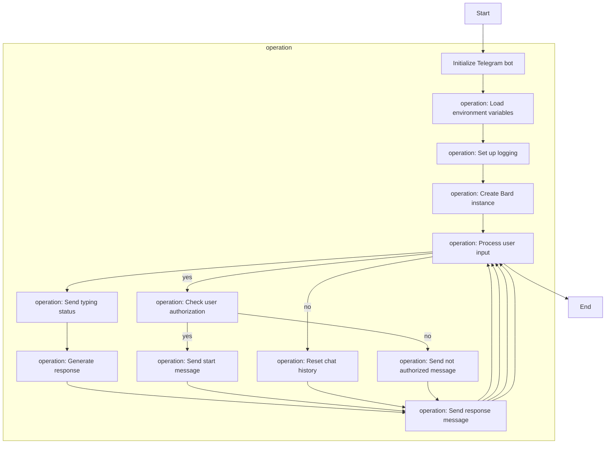

# bard-powered-telegram-bot

[](https://www.codefactor.io/repository/github/1999azzar/bard-powered-telegram-bot)

This repository contains code for a chatbot implemented in Python using the Telegram Bot API. The chatbot is designed to respond to user messages and provide assistance based on the input.

## Prerequisites

To run the chatbot, ensure you have the following:

1. Python 3.7 or above installed on your machine.
2. `python-telegram-bot` library. Install it using `pip install python-telegram-bot`.
3. A Telegram bot token. You can obtain one by creating a new bot through the BotFather on Telegram. Note down the bot token for later use.

## Installation

1. Clone the repository to your local machine or download the source code.
2. Install the required dependencies by running `pip install -r requirements.txt` in the project directory.
3. Set up environment variables:
   - Create a `.env` file in the project directory.
   - Add the following variables to the `.env` file:
     ```
     BARD_TOKEN=<your_bard_token>
     TELEGRAM_BOT_TOKEN=<your_telegram_bot_token>
     USER_ID=<your_user_id>
     ```
     Replace `<your_bard_token>` with the token for your Bard chatbot and `<your_telegram_bot_token>` with the token for your Telegram bot. `<your_user_id>` should be replaced with your Telegram user ID.
4. Run the chatbot by executing `python bot/main.py`.

## File Structure

The repository has the following structure:

```
bot/
  ├── bard.py
  ├── helper.py
  ├── main.py
.env
README.md
requirements.txt
```

- `bot/bard.py`: Contains the implementation of the [`Bard`](https://github.com/acheong08/Bard) class, which initializes the chatbot and processes user input to generate responses.
- `bot/helper.py`: Provides a helper function `is_user` to check if a user is authorized to use the bot.
- `bot/main.py`: The main file that sets up the Telegram bot, handles incoming messages, and triggers the chatbot for generating responses.

## Flowchart



## Usage

1. Start the bot by running `python bot/main.py`.
2. Open the Telegram app and search for your bot using the username you assigned to it during creation.
3. Start a chat with the bot and interact with it by sending messages.
4. The bot will process your input and provide a response based on the implemented logic.
5. You can use the `/start` command to initiate a conversation with the bot.
6. If you need to reset the chat history, you can use the `/reset` command.

Note: The bot will only respond to authorized users whose Telegram user ID matches the one specified in the `.env` file.

## Customization

You can customize the behavior and responses of the chatbot by modifying the code in `bot/bard.py`. You can add new functionalities or change the logic to suit your requirements.

## Contribution

Contributions to the project are welcome. If you encounter any issues or have suggestions for improvement, please submit an issue or a pull request to the repository.

## Acknowledgements

The code in this repository was developed based on the Python-Telegram-Bot library and follows best practices for Telegram bot development.

If you have any questions or need further assistance, please don't hesitate to reach out. Enjoy using the chatbot!
